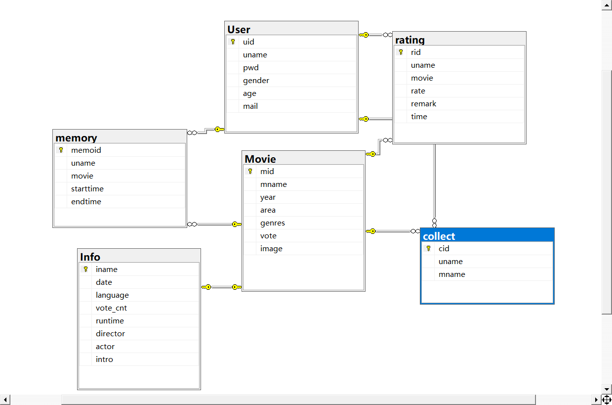

# MovieRecoder
一、应用简介
应用名称：Movie Recoder
Movie Recoder 是一款基于 C# 的 WinForm 窗体应用，旨在提供用户友好的电影管理和评价功能。通过简单的注册和登录流程，用户可以体验到类似于豆瓣的电影管理功能。以下是主要功能：
1.	注册和登录 
•	用户注册：新用户可以通过注册创建账号。 
•	用户登录：已有账号的用户可以通过登录进入应用。

3.	电影浏览和排序 
•	电影选择：用户可以浏览并选择电影。 
•	电影排序：用户可以按照特定的顺序对电影进行排序，例如按评分、上映时间等。
4.	电影详细信息 
•	获取最新电影：可以查看最新上映的四部电影。 
•	查看详情：点击电影标题可以查看该电影的详细信息，包括：
- 电影名
- 上映时间
- 制片地区
  - 主演
  - 导演
  - 评分
  - 评分人数
  - 片长
  - 简介
4.	评分和评价 
•	添加评分：用户可以为电影添加评分。 
•	撰写评价：用户可以撰写并提交对电影的评价。
5.	收藏和待看 
•	添加到收藏：用户可以将喜欢的电影添加到收藏列表。 
•	添加到待看：用户可以将电影添加到待看列表，并在待看页面设置开始观看时间和结束观看时间。
6.	个人主页 
•	修改个人信息：修改用户名、年龄、性别等信息 
•	修改密码
Movie Recoder致力于为电影爱好者提供一个便捷的平台来管理和评价电影，帮助用户更好地组织和计划他们的观影体验。

二、配置要求
1.	系统要求
为了确保 Movie Recoder 应用能够顺利运行，请确保您的系统满足以下要求：
•	操作系统：Windows 10 或以上
•	.NET Framework：4.7.2 或以上
•	内存：至少 4GB
•	硬盘空间：至少 500MB
•	显示分辨率：建议 1366x768 或更高
•	SQL Server：SQL Server 2016 或以上版本
2.	安装 SQL Server
下载和安装 SQL Server
（1）	访问 Microsoft SQL Server 下载页面。
（2）	选择适合的版本（开发版或表达版），下载安装程序。
（3）	运行安装程序并按照以下步骤进行安装：
•	选择 “新建 SQL Server 独立安装或添加功能到现有安装”。
•	在安装向导中，选择默认设置或自定义设置。
•	安装完成后，记录下 SQL Server 实例名称（例如 SQLEXPRESS）。

下载并安装 SQL Server Management Studio (SSMS)
（1）	访问 Microsoft SQL Server Management Studio 下载页面。
（2）	下载并安装最新版本的 SSMS。 
数据库结构：

